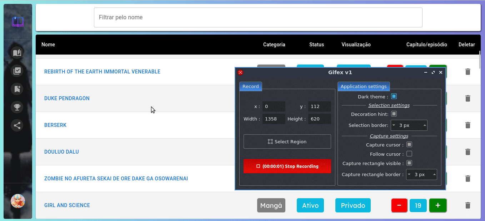
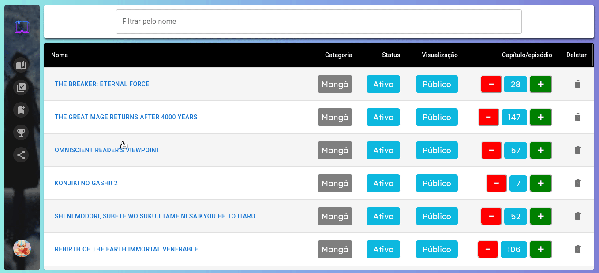

# projeto autoral-GeekBook

<p align="center">
  
</p>
<h1 align="center">
  GeekBook
</h1>
<div align="center">

  <h3>Built With</h3>

  
  
</div>

<br/>

# Description

GeekBook é um gerenciamento de mangás, animes, séries e novels.

</br>

## Features

- Criar uma conta e acessá-la
- Cadastrar uma obra e mudar qual foi seu último capítulo/episódio visto
- Criar um top 10 ranking das suas obras cadastradas
- Compartilhar sua coleção e ranking atraves de um link

</br>

## Rotas

### /

Essa rota é onde se faz o login do app.

É possivel fazer o login através:

- Do github.
- De um email cadastrado no app.

<h1 align="center" >

</h1>

#

### /active

Essa rota lista suas obras cadastradas ativas.

Nela é possivel:

- Visualizar o pôster e a sinopse da obra.
- Visualizar e mudar o status da obra (ativo ou completo).
- Visualizar e mudar a visualização da obra (público ou privado).
- Visualizar e mudar o ultímo capítulo/episódio visto.
  - Ao clicar no último capítulo/episodio da obra aparecera um input, para salvar o valor deve-se apertar o enter, Esc ou clicar no X o input some.
- Deletar a obra de sua coleção.
- Filtrar sua lista pelo nome.

<h1 align="center" >

</h1>

#

### /complete

Essa rota lista suas obras cadastradas completas.

Nela é possivel:

- Visualizar o pôster da obra.
- Visualizar e mudar o status da obra (ativo ou completo).
- Visualizar e mudar a visualização da obra (público ou privado).
- Visualizar e mudar o ultímo capítulo/episódio visto
  - Ao clicar no último capítulo/episodio da obra aparecera um input, para salvar o valor deve-se apertar o enter, Esc ou clicar no X o input some.
- Deletar a obra de sua coleção
- Filtrar sua lista pelo nome

<h1 align="center" >

</h1>

#

### /add

Nessa rota é possivel cadastrar uma obra em sua coleção.

- Categoria:
  - Selecione uma categoria e insira o nome da obra que você deseja acompanhar
    - O input de nome mostra as obras já cadastradas, caso você escolha uma delas a sinopse e o pôster virão preenchidos
- Descrição (opcional)
  - Preencha a sinopse e o link do pôster
- Informações adicionais
  - Preencha o último capítulo/episodio visto e o status dela.
  - Escolha qual é o status da obra (ativo ou completo)
  - Escolha qual é a visualização da obra (público ou privado)

<h1 align="center" >

</h1>

#

### /ranking

Nessa rota é possivel visualizar e mudar seu top 10 ranking.

- O input, do tipo auto complete, mostra as obras disponiveis para cada lugar do ranking

<h1 align="center" >

</h1>

#

## Feature: Compartilhar coleção

Ao clicar no compartilhar, localizado no sidebar, um link será gerado, ao acessar esse link será possivel visualizar a coleção e o ranking do dono do link

<h1 align="center" >

</h1>

#

## Environment Variables

To run this project, you will need to add the following environment variables to your .env file

`VITE_BASE_URL`

- endereço HTTP do backEnd, sem a barra final.

- Ex: http://localhost:5000

`VITE_APP_URL`

- endereço HTTP do frontEnd, sem a barra final.

- Ex: http://127.0.0.1:5173

`VITE_CLIENT_ID`

- O client Id do Github OAuth

`VITE_REDIRECT_URL`

- A url callback do Github OAuth

- O path deve ser `/oauth/github/`
  - Ex: http://localhost:5173/oauth/github/

[Github OAuth Docs](https://docs.github.com/en/developers/apps/building-oauth-apps/creating-an-oauth-app)

#

## Run Locally

NodeJS version
16.15.0

Clone the project

```bash
  git clone https://github.com/ThVinicius/geekBook_FrontEnd.git
```

Go to the project directory

```bash
  cd geekBook_FrontEnd
```

Install dependencies

```bash
  npm install
```

Start the server

```bash
  npm start
```

#

## Rodar os testes

1 - Vá para o diretório do back-end do projeto e execute o comando `npm run dev:test`

2 - Vá para o diretório do front-end do projeto e execute o comando `npm start`

3 - No diretório do front-end execute o comando `npx cypress open`

</br>

## Acknowledgements

- [Awesome Badges](https://github.com/Envoy-VC/awesome-badges)

</br>

## Authors

- Vinicius Pacheco is a student at Driven Education and is putting effort into it to switch careers. Nowadays he works with Engineering,
  looking forward to become a Dev.
  <br/>

#
